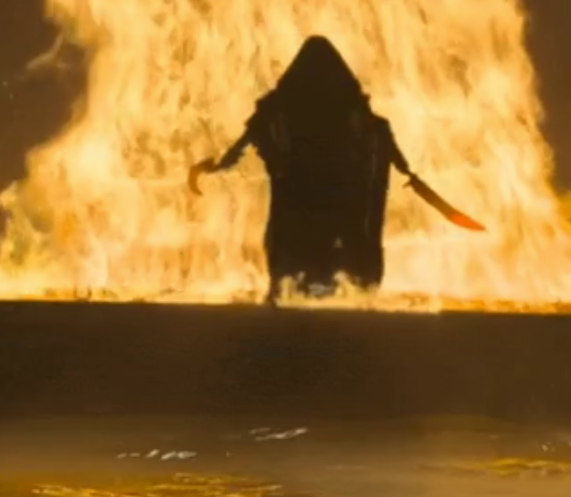

# Курсовая работа по Операционным Системам

Пролоббировал тему интересную мне, раза с 4 примерно подписал ТЗ (ОТЛ, сам писал)

Важно чтобы на тебя потратили время и почитали твоё РПЗ, дадут правки дальше проще будет. Кроме того, чем меньше текста, тем меньше правок. Никаких эпитетов и прилагательных, ржать и выставлять Вас идиотом будут за каждое слово, это норма, все проходили это. 

Просто живите, это последний семестр с ней, нужно пережить как бурю. Обязательно попросите кента, который уже сдавал, почитать ваше РПЗ. Я был этим кентом для двух человек, и они успешно прокинули курсачи в тот же день. 

Не показывайте, что вам не нравится препод, **используйте это**. Стоял в очереди сдавать, на лабе младшего курса, у меня было 2 или 3 захода. "Что Вы стоите у меня над душой, идите вон показывайте свой **бессмертный опус** 3 курсу", читать с язвительной интонацией. Взял двух ребят с первой парты и пошёл им защищать курсач и объяснять свою работу, спустя минут 15-20, когда они позадовали вопросы, интересующие их, а я убедился, что они поняли, мы закончили и пошли по местам. А я опять встал в очередь. НЮ видит это и обращается к младшим коллегам, как они оценивают мой курсач и спрашивает о чём он вообще. Они супер умницы, я прям ими горжусь, что они не растерялись и прям внятно и по делу ответили, **ОНИ ВСЁ ПОНЯЛИ)** Потом НЮ обращается ко мне и говорит: "Давайте зачётку". **Отл)**

ВЫЖИЛИ, МЫ БЛЯТЬ ВЫЖИЛИИИИИИИИИИИ